# K3s MCP Server

<p align="center">
  
</p>

<p align="center">
  <a href="https://www.python.org/downloads/"></a>
  <a href="https://github.com/astral-sh/uv"></a>
  <a href="https://modelcontextprotocol.io/"></a>
  <a href="https://k3s.io/"></a>
  <a href="LICENSE"></a>
</p>

A Model Context Protocol (MCP) server for managing Kubernetes (K3s) clusters. This server enables AI assistants like Claude to manage K3s clusters through natural language, and serves as the foundation for **Cortex Platform** - an AI-native infrastructure orchestration system.

## Cortex Platform: AI-Native Infrastructure on K3s

This project is part of the **Cortex Platform**, a production system that demonstrates advanced K3s usage patterns:

- **7-Layer Serverless Fabric** with KEDA auto-scaling (0→1 pods on demand)
- **AI-powered query routing** with multi-tier classification
- **Self-healing infrastructure** through MCP-based automation
- **Vector memory (Qdrant)** for learning from operational patterns
- **Dynamic worker pools** managed by AI agents

### Architecture Overview

```
┌─────────────────────────────────────────────────────────────────────────────┐
│                           CORTEX PLATFORM                                   │
│                        AI-Native K3s Infrastructure                         │
├─────────────────────────────────────────────────────────────────────────────┤
│                                                                             │
│   ┌─────────────────────────────────────────────────────────────────────┐   │
│   │                    K3s CLUSTER (7 nodes)                            │   │
│   │                    Talos Linux + etcd HA                            │   │
│   │                                                                     │   │
│   │   ┌─────────────────────────────────────────────────────────────┐   │   │
│   │   │              UNIFI LAYER FABRIC                             │   │   │
│   │   │         Serverless AI Network Operations                    │   │   │
│   │   │                                                             │   │   │
│   │   │   USER QUERY                                                │   │   │
│   │   │       │                                                     │   │   │
│   │   │       ▼                                                     │   │   │
│   │   │   ┌───────────────────┐    ┌─────────────────┐              │   │   │
│   │   │   │ CORTEX ACTIVATOR  │───▶│  CORTEX QDRANT  │              │   │   │
│   │   │   │   (Always On)     │    │  (Always On)    │              │   │   │
│   │   │   │   Query Router    │    │  Vector Memory  │              │   │   │
│   │   │   │   128MB, 2 pods   │    │  512MB, 5Gi PVC │              │   │   │
│   │   │   └─────────┬─────────┘    └─────────────────┘              │   │   │
│   │   │             │                                               │   │   │
│   │   │             │ 4-Tier Routing Cascade                        │   │   │
│   │   │             │ 2. Similarity Search (<50ms)                  │   │   │
│   │   │             │ 3. Lightweight Classifier (~5s cold)          │   │   │
│   │   │             │ 4. Full SLM Reasoning (~12s cold)             │   │   │
│   │   │             ▼                                               │   │   │
│   │   │   ┌─────────────────────────────────────────────────────┐   │   │   │
│   │   │   │            REASONING LAYERS (Scale 0→1)             │   │   │   │
│   │   │   │                                                     │   │   │   │
│   │   │   │   ┌──────────────────┐  ┌──────────────────────┐    │   │   │   │
│   │   │   │   │ reasoning-       │  │ reasoning-slm        │    │   │   │   │
│   │   │   │   │ classifier       │  │                      │    │   │   │   │
│   │   │   │   │ Qwen2 0.5B       │  │ Phi-3 3.8B           │    │   │   │   │
│   │   │   │   │ ~5s cold start   │  │ ~12s cold start      │    │   │   │   │
│   │   │   │   │ 400MB warm       │  │ 2.5GB warm           │    │   │   │   │
│   │   │   │   └──────────────────┘  └──────────────────────┘    │   │   │   │
│   │   │   └─────────────────────────────────────────────────────┘   │   │   │
│   │   │             │                                               │   │   │
│   │   │             ▼                                               │   │   │
│   │   │   ┌─────────────────────────────────────────────────────┐   │   │   │
│   │   │   │            EXECUTION LAYERS (Scale 0→1)             │   │   │   │
│   │   │   │                                                     │   │   │   │
│   │   │   │   ┌──────────────────┐  ┌──────────────────────┐    │   │   │   │
│   │   │   │   │ execution-       │  │ execution-           │    │   │   │   │
│   │   │   │   │ execution-       │  │ execution-           │    │   │   │   │
│   │   │   │   │ execution-       │  │ execution-           │    │   │   │   │
│   │   │   │   │ unifi-api        │  │ unifi-ssh            │    │   │   │   │
│   │   │   │   │ unifi-api        │  │ unifi-ssh            │    │   │   │   │
│   │   │   │   │ Primary          │  │ Failover             │    │   │   │   │
│   │   │   │   │ ~3s cold start   │  │ ~3s cold start       │    │   │   │   │
│   │   │   │   └──────────────────┘  └──────────────────────┘    │   │   │   │
│   │   │   └─────────────────────────────────────────────────────┘   │   │   │
│   │   │             │                                               │   │   │
│   │   │             ▼                                               │   │   │
│   │   │   ┌───────────────────┐                                     │   │   │
│   │   │   │ CORTEX TELEMETRY  │                                     │   │   │
│   │   │   │ Metrics + Learning│                                     │   │   │
│   │   │   │ Scale 0→1         │                                     │   │   │
│   │   │   └───────────────────┘                                     │   │   │  
│   │   └─────────────────────────────────────────────────────────────┘   │   │
│   │                                                                     │   │
│   │   ┌─────────────────────────────────────────────────────────────┐   │   │
│   │   │                    MCP SERVERS                              │   │   │
│   │   │                                                             │   │   │
│   │   │   ┌──────────────┐  ┌──────────────┐  ┌──────────────┐      │   │   │
│   │   │   │ k3s-mcp      │  │ talos-mcp    │  │ proxmox-mcp  │      │   │   │
│   │   │   │ (this repo)  │  │              │  │              │      │   │   │
│   │   │   │ Cluster ops  │  │ Node mgmt    │  │ VM lifecycle │      │   │   │
│   │   │   └──────────────┘  └──────────────┘  └──────────────┘      │   │   │
│   │   └─────────────────────────────────────────────────────────────┘   │   │
│   │                                                                     │   │
│   │   ┌─────────────────────────────────────────────────────────────┐   │   │
│   │   │              DYNAMIC WORKER POOLS                           │   │   │
│   │   │         (Managed by AI Resource Manager)                    │   │   │
│   │   │                                                             │   │   │
│   │   │   Permanent: 3-10 nodes (always running)                    │   │   │
│   │   │   Burst:     0-20 nodes (TTL-based cleanup)                 │   │   │
│   │   │   Spot:      0-15 nodes (70% cost savings)                  │   │   │
│   │   │   GPU:       0-5 nodes  (special hardware taints)           │   │   │
│   │   └─────────────────────────────────────────────────────────────┘   │   │
│   └─────────────────────────────────────────────────────────────────────┘   │
│                                                                             │
│   Memory Profile:                                                           │
│   • Idle:         640MB  (Activator + Qdrant only)                          │
│   • Simple query: 1GB    (+ execution layer)                                │
│   • Complex:      4GB    (+ SLM reasoning)                                  │
│   • Savings:      85%+   vs always-on architecture                          │
│                                                                             │
└─────────────────────────────────────────────────────────────────────────────┘
```

### The 7 Layers

| Layer | Component | Purpose | Memory | Cold Start | Scale |
|-------|-----------|---------|--------|------------|-------|
| 1 | **cortex-activator** | Query routing & orchestration | 128MB | Always on | 2 replicas |
| 2 | **cortex-qdrant** | Vector memory & RAG | 512MB | Always on | 1 replica |
| 3 | **reasoning-classifier** | Fast intent classification | 400MB | ~5s | 0→1 |
| 4 | **reasoning-slm** | Full reasoning (Phi-3) | 2.5GB | ~12s | 0→1 |
| 5 | **execution-unifi-api** | Primary API operations | 200MB | ~3s | 0→2 |
| 6 | **execution-unifi-ssh** | Failover & diagnostics | 100MB | ~3s | 0→1 |
| 7 | **cortex-telemetry** | Metrics & learning pipeline | 128MB | ~2s | 0→1 |

### Cortex Activator: Intelligent Query Router

The Cortex Activator is the brain of the system - a lightweight service that routes queries through a 4-tier cascade:

```
Query: "Block the client with MAC aa:bb:cc:dd:ee:ff"
         │
         ▼
┌─────────────────────────────────────────────────────────────┐
│ TIER 1: Keyword Pattern Match (<10ms)                       │
│                                                             │
│ Pattern: "(block|unblock).*client" → MATCH                  │
│ Confidence: 95%                                             │
│ Action: Route directly to execution-unifi-api               │
└─────────────────────────────────────────────────────────────┘
         │
         │ (If no match, continue to Tier 2)
         ▼
┌─────────────────────────────────────────────────────────────┐
│ TIER 2: Qdrant Similarity Search (<50ms)                    │
│                                                             │
│ Query embedding → Search past successful routes             │
│ If similar query succeeded before → Reuse routing           │
│ Learning: Skip expensive LLM classification                 │
└─────────────────────────────────────────────────────────────┘
         │
         │ (If similarity < 92%, continue to Tier 3)
         ▼
┌─────────────────────────────────────────────────────────────┐
│ TIER 3: Lightweight Classifier (~5s cold start)             │
│                                                             │
│ Model: Qwen2-0.5B (quantized)                               │
│ Use: Ambiguous queries needing quick classification         │
│ KEDA: Scales from 0→1 on demand                             │
└─────────────────────────────────────────────────────────────┘
         │
         │ (If complex investigation needed, continue to Tier 4)
         ▼
┌─────────────────────────────────────────────────────────────┐
│ TIER 4: Full SLM Reasoning (~12s cold start)                │
│                                                             │
│ Model: Phi-3-mini-4k-instruct (3.8B, quantized)             │
│ Use: Multi-step reasoning, complex troubleshooting          │
│ KEDA: Scales from 0→1 on demand                             │
└─────────────────────────────────────────────────────────────┘
```

### KEDA Serverless Scaling

Layers scale from 0 to 1 based on Prometheus metrics:

```yaml
# reasoning-slm KEDA configuration
keda:
  minReplicaCount: 0      # Scale to zero when idle
  maxReplicaCount: 1
  cooldownPeriod: 300     # Scale down after 5 min idle
  trigger:
    type: prometheus
    query: sum(cortex_activator_pending_requests{layer="reasoning-slm"})
    threshold: "1"        # Wake if ANY pending request
```

**Activation flow:**
1. Query arrives → Activator increments `pending_requests` gauge
2. KEDA detects metric > threshold → Scales deployment 0→1
3. Pod starts → Health probe passes → Pod ready
4. Request processed → Response sent
5. 5 minutes idle → Cooldown triggers → Scales back to 0

### Adaptive Intelligence (Phase 4)

Query complexity scoring (0-100) determines execution mode:

| Complexity | Score | Mode | Resources |
|------------|-------|------|-----------|
| SIMPLE | 0-25 | Direct execution | Activator only |
| MODERATE | 26-50 | Basic classification | + Classifier |
| COMPLEX | 51-75 | Full reasoning | + SLM |
| EXPERT | 76-100 | Escalation | Human review |

**Auto-escalation triggers:**
- Low confidence (<50%) → Escalate mode
- Previous similar queries failed → Escalate
- Timeout (>30s agent, >60s hybrid) → Escalate

---

## K3s MCP Server Features

This MCP server provides the foundation for AI-driven cluster management:

### Pod Management
- List pods across namespaces with label selectors
- Get pod logs with tail and container selection
- Execute commands in pods
- Restart pods (delete and recreate)

### Deployment Management
- List and describe deployments
- Scale deployments up or down
- Get deployment status and replica counts

### Service Management
- List services and endpoints
- View service ports and selectors
- Check service types (ClusterIP, NodePort, LoadBalancer)

### Node Management
- List all cluster nodes
- Get node status and resources
- View node capacity and allocatable resources
- Check node conditions (Ready, MemoryPressure, etc.)

### Resource Management
- Apply YAML manifests
- Delete resources (pods, deployments, services)
- List namespaces
- Get cluster information

## Quick Start

```bash
# 1. Install uv (if not already installed)
curl -LsSf https://astral.sh/uv/install.sh | sh

# 2. Clone this repository
git clone https://github.com/ry-ops/k3s-mcp-server.git
cd k3s-mcp-server

# 3. Run setup script
chmod +x setup.sh
./setup.sh

# 4. Set environment variables
export KUBECONFIG="$HOME/.kube/config"

# 5. Test the server
uv run k3s-mcp-server

# 6. Configure Claude Desktop and restart
```

See [QUICKSTART.md](QUICKSTART.md) for detailed instructions.

## Installation

### Prerequisites

- Python 3.10 or higher
- `uv` package manager
- K3s cluster with kubeconfig access
- Kubeconfig file

### Setup

```bash
# Install uv
curl -LsSf https://astral.sh/uv/install.sh | sh

# Clone this repository
git clone https://github.com/ry-ops/k3s-mcp-server.git
cd k3s-mcp-server

# Run setup script (creates structure and installs dependencies)
./setup.sh

# Or manually:
uv sync
```

## Configuration

### Environment Variables

| Variable | Description | Default |
|----------|-------------|---------|
| `KUBECONFIG` | Path to kubeconfig file | `~/.kube/config` |
| `K3S_DEFAULT_NAMESPACE` | Default namespace | `default` |
| `K3S_DEBUG` | Enable debug logging | `false` |

### Claude Desktop Configuration

**MacOS**: `~/Library/Application Support/Claude/claude_desktop_config.json`
**Windows**: `%APPDATA%/Claude/claude_desktop_config.json`

```json
{
  "mcpServers": {
    "k3s": {
      "command": "uv",
      "args": [
        "--directory",
        "/absolute/path/to/k3s-mcp-server",
        "run",
        "k3s-mcp-server"
      ],
      "env": {
        "KUBECONFIG": "/path/to/.kube/config"
      }
    }
  }
}
```

## Available Tools

### Pod Tools

| Tool | Description | Parameters |
|------|-------------|------------|
| `get_pods` | List pods in namespace or cluster-wide | `namespace`, `labels` |
| `get_logs` | Get pod logs | `pod_name`, `namespace`, `container`, `tail_lines` |
| `restart_pod` | Restart a pod by deleting it | `name`, `namespace` |
| `execute_command` | Execute command in pod | `pod_name`, `namespace`, `command`, `container` |

### Deployment Tools

| Tool | Description | Parameters |
|------|-------------|------------|
| `get_deployments` | List all deployments | `namespace` |
| `get_deployment` | Get specific deployment details | `name`, `namespace` |
| `scale_deployment` | Scale deployment replicas | `name`, `namespace`, `replicas` |

### Cluster Tools

| Tool | Description | Parameters |
|------|-------------|------------|
| `get_nodes` | List all nodes with resources | - |
| `get_services` | List all services | `namespace` |
| `get_cluster_info` | Get cluster version and summary | - |
| `get_namespaces` | List all namespaces | - |
| `apply_manifest` | Apply YAML manifest | `manifest_yaml`, `namespace` |
| `delete_resource` | Delete a resource | `kind`, `name`, `namespace` |

## Example Usage

Once configured, ask Claude to interact with your K3s cluster:

```
"List all pods in the cortex-system namespace"

"What's the status of the cortex-activator deployment?"

"Scale reasoning-slm to 1 replica"

"Show me logs from the cortex-qdrant pod"

"Which nodes are in my cluster and what's their capacity?"

"Apply this deployment manifest: [YAML content]"
```

## Project Structure

```
k3s-mcp-server/
├── src/
│   └── k3s_mcp_server/
│       ├── __init__.py       # Package initialization
│       └── server.py         # Main server implementation
├── docs/
│   ├── ARCHITECTURE.md       # Detailed architecture docs
│   └── CORTEX_INTEGRATION.md # Cortex Platform integration
├── pyproject.toml            # Project configuration
├── uv.lock                   # Locked dependencies
├── setup.sh                  # Automated setup script
├── README.md                 # This file
└── QUICKSTART.md             # Quick setup guide
```

## K3s Features Used

This project demonstrates production usage of K3s features:

| Feature | Usage |
|---------|-------|
| **Namespaces** | Multi-tenant isolation (cortex-system, cortex-mcp, cortex-unifi) |
| **Deployments** | All workloads with rolling updates |
| **KEDA** | Serverless 0→1 scaling for reasoning/execution layers |
| **Helm** | Package management for all components |
| **RBAC** | Fine-grained service account permissions |
| **PVCs** | Persistent storage for Qdrant vector database |
| **ConfigMaps/Secrets** | Configuration management |
| **Health Probes** | Liveness, readiness, startup probes |
| **Resource Limits** | CPU/memory requests and limits |
| **Pod Anti-Affinity** | HA distribution across nodes |
| **ArgoCD** | GitOps continuous deployment |

## Security Considerations

- **Kubeconfig Security**: Keep your kubeconfig file secure (chmod 600)
- **RBAC**: Ensure appropriate permissions for the kubeconfig user
- **Network Access**: Secure network connectivity to K3s API server
- **Audit**: K8s API server logs all actions for auditing

## Troubleshooting

### Connection Errors
- Verify `KUBECONFIG` path is correct and file exists
- Check network connectivity to K3s server
- Test with: `kubectl --kubeconfig /path/to/config get nodes`

### Authentication Errors
- Verify kubeconfig contains valid credentials
- Check if certificates are valid and not expired

### Tools Not Showing in Claude
- Verify absolute path in Claude config
- Check that config file is valid JSON
- Restart Claude Desktop completely

### Debug Mode
```bash
export K3S_DEBUG=true
uv run k3s-mcp-server
```

## Roadmap

- [ ] ConfigMap and Secret management
- [ ] PersistentVolume and PVC operations
- [ ] Ingress management
- [ ] Job and CronJob support
- [ ] StatefulSet operations
- [ ] HorizontalPodAutoscaler (HPA) configuration
- [ ] Helm chart deployment support
- [ ] KEDA ScaledObject management

## Dependencies

- **mcp** (>=1.0.0): Model Context Protocol SDK
- **kubernetes** (>=29.0.0): Official Python client for Kubernetes
- **pyyaml** (>=6.0): YAML parser for manifest handling

## Contributing

Contributions welcome! Areas for improvement:
- Additional resource types
- Better error handling
- Performance optimizations
- Documentation improvements
- Test coverage

## License

MIT

## Related Projects

- [Model Context Protocol](https://modelcontextprotocol.io/)
- [K3s - Lightweight Kubernetes](https://k3s.io/)
- [KEDA - Kubernetes Event-driven Autoscaling](https://keda.sh/)
- [Qdrant - Vector Database](https://qdrant.tech/)
- [uv - Python Package Manager](https://github.com/astral-sh/uv)

---

**Part of the Cortex Platform** - AI-native infrastructure orchestration on K3s
