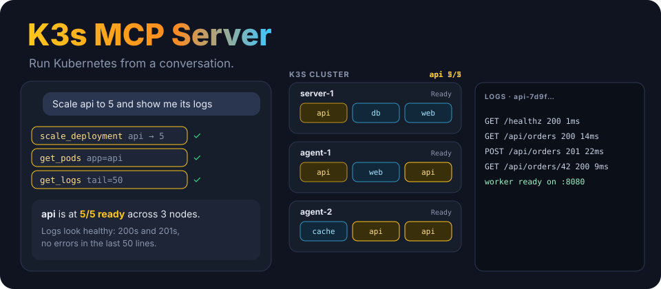
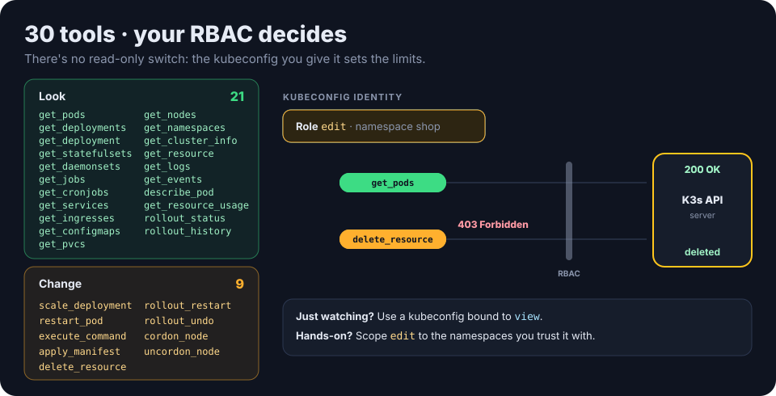

<p align="center">
  
</p>

<p align="center">
  <a href="https://github.com/ry-ops/k3s-mcp-server/releases/latest"></a>
  
  <a href="https://www.python.org/downloads/"></a>
  <a href="https://modelcontextprotocol.io/"></a>
  <a href="https://k3s.io/"></a>
  <a href="LICENSE"></a>
</p>

<p align="center"><b>Run your Kubernetes cluster from a conversation.</b> An MCP server that gives Claude, or any MCP client, 23 tools for K3s, built on the official Kubernetes Python client and your kubeconfig. It works with any Kubernetes cluster, not just K3s.</p>

<p align="center">
  <a href="#tools">Tools</a> ·
  <a href="#safety">Safety</a> ·
  <a href="#setup">Setup</a> ·
  <a href="#guides">Guides</a> ·
  <a href="#troubleshooting">Troubleshooting</a>
</p>

---

## ✨ What you can ask

> *"What's running in the `shop` namespace?"*
> *"Why is the api pod crash-looping? Show me its restarts and last 100 log lines."*
> *"Which pods are labelled `app=web`, and which nodes are they on?"*
> *"Scale `web` to 3 replicas."*
> *"Restart the stuck worker pod."*
> *"Run `env` inside the api container."*
> *"Create this deployment."* (paste the YAML)
> *"Which nodes are Ready, and how much capacity do they have?"*

## 🌟 Why this one

- **Reads and writes, 23 tools.** Workloads (deployments, StatefulSets, DaemonSets, Jobs, CronJobs), networking (services, ingresses), config and storage (ConfigMaps, volume claims), nodes and logs to look; scale, restart, exec, apply and delete to act.
- **Built for troubleshooting.** Events, a pod's container states and exit codes, logs from the crashed container, and live CPU and memory from metrics-server, so *"why is this pod crash-looping?"* gets a real answer.
- **Apply like kubectl.** `apply_manifest` uses server-side apply: it creates or updates, takes several YAML documents at once, handles any kind including custom resources, and has a dry run. `delete_resource` takes any kind too, with its own dry run.
- **Least privilege, ready to apply.** [`deploy/rbac.yaml`](deploy/rbac.yaml) gives the server its own service account: it can read everywhere, write only in the namespaces you pick, and never read Secrets outside them. Delete one Secret to cut it off.
- **Cluster-wide by default.** List tools search every namespace unless you name one, and label selectors narrow them down.
- **Any client, any number of clusters.** Works with Claude Code, Claude Desktop or any stdio MCP client. Register it once per kubeconfig and say *"on k3s-prod, …"*.
- **Checks itself first.** `scripts/test-connection.sh` runs the server's own client against your cluster before you connect a client.
- **Small enough to read.** One Python module on the official Kubernetes client, with no database, no daemon and no state. [ARCHITECTURE.md](docs/ARCHITECTURE.md) maps every tool to its API call and the RBAC it needs.

<a id="tools"></a>

## 🧰 Tools

<p align="center">
  
</p>

| | Tool | What it does |
|---|---|---|
| 👀 | `get_pods` | Pods in one namespace or all of them, filtered by label, with status, node, IPs and restart counts |
| 👀 | `get_deployments` · `get_deployment` | Deployments in one namespace or all of them, or the details of one |
| 👀 | `get_statefulsets` · `get_daemonsets` | StatefulSets and DaemonSets with replica or scheduling counts and images |
| 👀 | `get_jobs` · `get_cronjobs` | Jobs with their outcome and failure reason; CronJobs with schedule and last runs |
| 👀 | `get_services` | Services in one namespace or all of them |
| 👀 | `get_ingresses` | Ingresses with hosts, paths, backend services, TLS hosts and addresses |
| 👀 | `get_configmaps` | ConfigMaps and their keys, or one ConfigMap's data |
| 👀 | `get_pvcs` | Volume claims with status, size, storage class and bound volume |
| 👀 | `get_nodes` | Nodes with roles, Ready and pressure conditions, versions, OS and capacity |
| 👀 | `get_namespaces` | All namespaces |
| 👀 | `get_logs` | A pod's logs; choose the container and how many lines to tail, or read the previous (crashed) container's logs |
| 👀 | `get_events` | Events, newest first, filtered by namespace, object, kind or `Warning` |
| 👀 | `describe_pod` | A pod's conditions, container states, restarts, last exit code and reason, resources and recent events (no environment variables) |
| 👀 | `get_resource_usage` | CPU and memory for pods or nodes from metrics-server, nodes as a percent of allocatable |
| 👀 | `get_cluster_info` | Version, nodes and namespaces at a glance |
| ✏️ | `scale_deployment` | Set a deployment's replica count |
| ✏️ | `restart_pod` | Delete a pod so its controller recreates it |
| ✏️ | `execute_command` | Run a command in a pod's container |
| ✏️ | `apply_manifest` | Server-side apply of YAML: create or update any kind, several documents at once, with dry run and conflict reporting |
| ✏️ | `delete_resource` | Delete an object of any kind, by kind or short name (`deploy`, `cm`, `pvc`), with dry run |

<a id="safety"></a>

## 🔒 Safety

There's **no read-only switch**. The server can do whatever the **kubeconfig** it uses is allowed to do, and five tools change things, including running commands inside containers. So don't hand it cluster-admin. [`deploy/rbac.yaml`](deploy/rbac.yaml) sets up a service account that can:

- **Read** across the cluster (the built-in **`view`** role, plus nodes). It can't read Secrets.
- **Write** only in the namespaces you give an **`edit`** RoleBinding. The file binds `default`; change it, copy the block for more namespaces, or delete it for read-only. Writes anywhere else fail with `403 Forbidden` at the API server.
- **Custom resources** only if their CRD opts in. `view` and `edit` include a custom resource only when its ClusterRoles aggregate into them, and many CRDs, Traefik's among them, don't. Grant those kinds with your own Role if you want the server to manage them.

Apply it with your admin kubeconfig, then build a kubeconfig for the server from the service account's token:

```bash
kubectl apply -f deploy/rbac.yaml

SERVER=$(kubectl config view --minify -o jsonpath='{.clusters[0].cluster.server}')
CA=$(kubectl config view --raw --minify -o jsonpath='{.clusters[0].cluster.certificate-authority-data}')
TOKEN=$(kubectl -n k3s-mcp get secret k3s-mcp-token -o jsonpath='{.data.token}' | base64 --decode)

umask 077
cat > ~/.kube/k3s-mcp.yaml <<EOF
apiVersion: v1
kind: Config
clusters:
- name: k3s
  cluster: {server: $SERVER, certificate-authority-data: $CA}
users:
- name: k3s-mcp
  user: {token: $TOKEN}
contexts:
- name: k3s-mcp
  context: {cluster: k3s, user: k3s-mcp, namespace: default}
current-context: k3s-mcp
EOF
```

Point `KUBECONFIG` at `~/.kube/k3s-mcp.yaml`. To revoke access, delete the token: `kubectl -n k3s-mcp delete secret k3s-mcp-token`.

**Keep your MCP client's tool approval on**, so you see each call before it runs.

<a id="setup"></a>

## 🚀 Setup

You need **Python 3.10+** with [`uv`](https://github.com/astral-sh/uv), and a cluster whose API server you can reach. [QUICKSTART.md](docs/QUICKSTART.md) walks through every step, including getting the kubeconfig off a K3s node.

```bash
git clone https://github.com/ry-ops/k3s-mcp-server && cd k3s-mcp-server
bash scripts/setup.sh                            # or: uv sync
export KUBECONFIG="$HOME/.kube/k3s-mcp.yaml"     # the scoped kubeconfig from Safety
bash scripts/test-connection.sh
```

**Connect Claude Code** in one command, available in every project:

```bash
claude mcp add k3s --scope user -e KUBECONFIG="$HOME/.kube/k3s-mcp.yaml" \
  -- uv --directory "$PWD" run k3s-mcp-server
```

**Or Claude Desktop.** Add this to `~/Library/Application Support/Claude/claude_desktop_config.json` on macOS, or `%APPDATA%\Claude\claude_desktop_config.json` on Windows, then quit and reopen the app:

```json
{
  "mcpServers": {
    "k3s": {
      "command": "uv",
      "args": ["--directory", "/absolute/path/to/k3s-mcp-server", "run", "k3s-mcp-server"],
      "env": { "KUBECONFIG": "/absolute/path/to/k3s-mcp.yaml" }
    }
  }
}
```

[CLIENTS.md](docs/CLIENTS.md) covers other clients and running several clusters side by side.

| Variable | Default | What it does |
|---|---|---|
| `KUBECONFIG` | `~/.kube/k3s-cortex-config.yaml` | The kubeconfig to use; its current context and RBAC decide what the server can reach. **Set it.** The default is a leftover name, not the usual `~/.kube/config`. |
| `K3S_DEFAULT_NAMESPACE` | `default` | Where single-object tools act when a call doesn't name a namespace. List tools search all namespaces instead. |
| `K3S_DEBUG` | `false` | Extra startup logging to stderr |

<a id="guides"></a>

## 📚 Guides

| | |
|---|---|
| [QUICKSTART.md](docs/QUICKSTART.md) | From clone to a working client, with least-privilege access and a checklist |
| [CLIENTS.md](docs/CLIENTS.md) | Claude Code, Claude Desktop, several clusters, settings, troubleshooting |
| [ARCHITECTURE.md](docs/ARCHITECTURE.md) | How a call flows, namespace rules, every tool's API call and RBAC, known limits |
| [deploy/rbac.yaml](deploy/rbac.yaml) | The service account, roles and bindings |

<a id="troubleshooting"></a>

## 🩺 Troubleshooting

<details>
<summary><b>"Kubeconfig not found"</b></summary>

Set `KUBECONFIG` to an absolute path. Without it, the server looks for `~/.kube/k3s-cortex-config.yaml`.
</details>

<details>
<summary><b>Connection refused or timeouts</b></summary>

- The `server:` URL in your kubeconfig must be reachable from where the server runs.
- K3s writes `https://127.0.0.1:6443` by default; change it to the server's address.
</details>

<details>
<summary><b>403 Forbidden</b></summary>

That's RBAC working. The kubeconfig's identity isn't allowed to do that. To allow writes in another namespace, add an `edit` RoleBinding there. See [Safety](#safety).
</details>

<details>
<summary><b>Apply failed with a conflict</b></summary>

Another field manager owns that field. A common case: you scaled a deployment with `scale_deployment`, then applied YAML with a different `replicas`. Ask to apply again with `force` to take the field over, or drop it from the YAML.
</details>

<details>
<summary><b>Tools don't show up in Claude</b></summary>

Use absolute paths, check the config is valid JSON, and quit Claude Desktop completely before reopening it. Then check the client's log for the server's stderr. More in [CLIENTS.md](docs/CLIENTS.md#troubleshooting).
</details>

## 🧱 Project layout

```
src/k3s_mcp_server/server.py   the server that gets packaged and installed (23 tools)
docs/                          QUICKSTART, CLIENTS and ARCHITECTURE guides, and the animations on this page
scripts/                       setup.sh and test-connection.sh
deploy/rbac.yaml               a least-privilege service account for the server
```

Dependencies: `mcp`, `kubernetes` (the official client) and `pyyaml`.

## 🌐 Origins

Built as one of the infrastructure tools for the [Cortex](https://github.com/ry-ops/cortex) platform, which is now archived. The server doesn't depend on Cortex and runs against any cluster.

## License

MIT. See [LICENSE](LICENSE).

<!-- org-footer -->
---

<p align="center"><sub>Part of <a href="https://github.com/ry-ops">ry-ops</a> · building the pipes between infrastructure, automation, and observability · built by <a href="https://github.com/ry-ops">ry-ops</a></sub></p>
