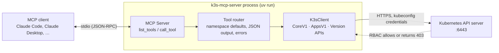
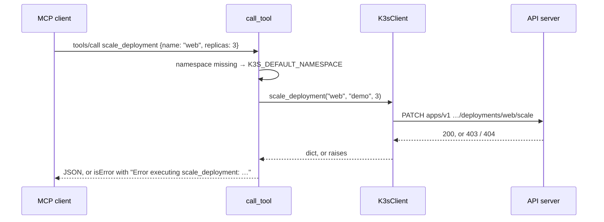

# Architecture

k3s-mcp-server is one Python module, [`src/k3s_mcp_server/server.py`](../src/k3s_mcp_server/server.py). It turns MCP tool calls into Kubernetes API calls through the official Python client. It has no database, no cache and no state between calls. The kubeconfig decides which cluster it reaches and what it may do there.



## Components

| Piece | What it does |
|---|---|
| **MCP server** | `mcp.server.Server` from the MCP Python SDK (pinned below 2.0). `list_tools` returns 32 tool definitions with JSON Schemas. `call_tool` hands each call to the router. It runs over stdio until the client closes the pipe. |
| **Tool router** | One `call_tool` function: fills in the default namespace, calls the matching `K3sClient` method, and formats the result. |
| **`K3sClient`** | Loads the kubeconfig once and holds the API clients. The tools use `CoreV1Api`, `AppsV1Api`, `BatchV1Api`, `NetworkingV1Api`, `CustomObjectsApi` for metrics, and a `DynamicClient` for `apply_manifest`, `get_resource` and `delete_resource`, which is created on first use because it runs API discovery. Each method is a thin wrapper over one or two API calls that trims the response down to the fields worth reading. |
| **Kubernetes API** | Does all the real work, including authentication and authorization. The server never checks permissions itself. |

## Startup

1. The client runs `uv --directory <repo> run k3s-mcp-server`. That console script calls `run()`, which runs the async `main()`.
2. Importing the module creates the single `K3sClient`, which loads `$KUBECONFIG` (default `~/.kube/config`) into its own `ApiClient`. A missing or unreadable file prints an error to stderr and **exits**. Every API client (core, apps, batch, networking, custom objects, dynamic, version) is built from that one `ApiClient`, so `use_cluster` can swap them all at once. Nothing is reported over MCP, so check the client's log.
3. `main()` opens the stdio transport and serves requests. Everything the server prints goes to stderr, because stdout carries the protocol.

Loading the kubeconfig doesn't contact the cluster. An unreachable API server shows up as an error on the first tool call, not at startup.

## A tool call



### Namespaces

- **List tools** (`get_pods`, `get_deployments`, `get_statefulsets`, `get_daemonsets`, `get_jobs`, `get_cronjobs`, `get_services`, `get_ingresses`, `get_configmaps`, `get_pvcs`, `get_events`, `get_resource_usage`): no namespace means **all namespaces** (`list_*_for_all_namespaces`).
- **Single-object tools**: no namespace means `K3S_DEFAULT_NAMESPACE` (default `default`). That includes `get_configmaps` when it's given a `name`, the rollout tools, and `delete_resource` for namespaced kinds. `get_resource` follows the list rule: no namespace lists all namespaces.
- **`apply_manifest`**: for namespaced kinds, uses the `namespace` argument, then the manifest's own `metadata.namespace`, then `K3S_DEFAULT_NAMESPACE`. Cluster-scoped kinds get no namespace.

### Results and errors

- Structured results are returned as pretty-printed JSON in a single `TextContent`. Logs and command output come back as plain text.
- `apply_manifest` reports each document separately: `created`, `configured`, `unchanged`, or the API server's error message. One failing document doesn't stop the rest.
- Any other exception, whether an API error, unsupported kind or bad YAML, becomes an MCP error result: `isError: true` with the text `Error executing <tool>: <message>`, including the HTTP status or the API server's message (for example `(403) Reason: Forbidden`). Arguments that don't match a tool's input schema are rejected the same way before the tool runs.

## Tools and the API calls behind them

| Tool | Kubernetes API | RBAC it needs |
|---|---|---|
| `get_pods` | `list_namespaced_pod` / `list_pod_for_all_namespaces`, with an optional label selector | `list pods` |
| `get_deployments` | `list_namespaced_deployment` / `list_deployment_for_all_namespaces` | `list deployments.apps` |
| `get_deployment` | `read_namespaced_deployment` | `get deployments.apps` |
| `get_statefulsets` | `list_namespaced_stateful_set` / `list_stateful_set_for_all_namespaces` | `list statefulsets.apps` |
| `get_daemonsets` | `list_namespaced_daemon_set` / `list_daemon_set_for_all_namespaces` | `list daemonsets.apps` |
| `get_jobs` | `list_namespaced_job` / `list_job_for_all_namespaces`; status comes from the `Complete`, `Failed` and `Suspended` conditions | `list jobs.batch` |
| `get_cronjobs` | `list_namespaced_cron_job` / `list_cron_job_for_all_namespaces` | `list cronjobs.batch` |
| `get_services` | `list_namespaced_service` / `list_service_for_all_namespaces` | `list services` |
| `get_ingresses` | `list_namespaced_ingress` / `list_ingress_for_all_namespaces` | `list ingresses.networking.k8s.io` |
| `get_configmaps` | `list_namespaced_config_map` / `list_config_map_for_all_namespaces` (keys only), or `read_namespaced_config_map` with `name` (values over 4,000 characters are truncated) | `list` or `get configmaps` |
| `get_pvcs` | `list_namespaced_persistent_volume_claim` / `list_persistent_volume_claim_for_all_namespaces` | `list persistentvolumeclaims` |
| `get_nodes` | `list_node` | `list nodes` (cluster-scoped; the built-in `view` role doesn't include it) |
| `get_namespaces` | `list_namespace` | `list namespaces` |
| `get_logs` | `read_namespaced_pod_log` with `tail_lines` (default 100) and optional `previous` | `get pods/log` |
| `get_events` | `list_namespaced_event` / `list_event_for_all_namespaces`, with field selectors for object name, kind and type; sorted newest first | `list events` |
| `describe_pod` | `read_namespaced_pod` + `list_namespaced_event` for that pod. Environment variables are left out because they can hold credentials. | `get pods`, `list events` |
| `get_resource_usage` | `metrics.k8s.io/v1beta1` pods or nodes through `CustomObjectsApi`, plus `list_node` for node allocatable | `list pods.metrics.k8s.io` or `nodes.metrics.k8s.io` (metrics-server aggregates these into `view`), and `list nodes` |
| `get_resource` | Discovery resolves the kind, then a dynamic `get` (list with `limit` and a label selector, or one object without `managedFields`). Secrets are refused before any call. | `list` or `get` on that kind |
| `rollout_status` | `read_namespaced_{deployment,stateful_set,daemon_set}`, polled every 2 s up to `wait_seconds` (max 300). Done and failed follow kubectl's rules, including `ProgressDeadlineExceeded`. | `get` on that kind |
| `rollout_history` | `read_namespaced_deployment` + `list_namespaced_replica_set` by the deployment's selector, kept if owned by it, keyed by `deployment.kubernetes.io/revision` | `get deployments.apps`, `list replicasets.apps` |
| `get_cluster_info` | `VersionApi.get_code` + `list_node` + `list_namespace` | `list nodes`, `list namespaces` |
| `list_clusters` | No API call: reads the kubeconfigs in `K3S_KUBECONFIG_DIR` (skipping `*-admin.yaml`) plus `KUBECONFIG`, and returns each current context's server and namespace | none |
| `use_cluster` | `new_client_from_config` for that file, then `VersionApi.get_code` to check it; only on success are the API clients swapped | whatever the new file's identity has |
| `scale_deployment` | `patch_namespaced_deployment_scale` | `patch deployments.apps/scale` |
| `restart_pod` | `delete_namespaced_pod`; the owning controller re-creates it | `delete pods` |
| `execute_command` | `connect_get_namespaced_pod_exec` over a WebSocket stream, no TTY or stdin | `create pods/exec` |
| `apply_manifest` | Per document: discovery for the kind, `get`, then a server-side apply `PATCH` (`application/apply-patch+yaml`, field manager `k3s-mcp-server`, optional `dryRun=All` and `force`) | `get` and `patch` on that kind (apply creates through `patch`) |
| `rollout_restart` | Strategic merge patch of `spec.template.metadata.annotations["kubectl.kubernetes.io/restartedAt"]` | `patch` on that kind |
| `rollout_undo` | As `rollout_history`, then a JSON patch replacing `spec.template` with the target ReplicaSet's template (minus `pod-template-hash`) | `patch deployments.apps`, `list replicasets.apps` |
| `cordon_node` / `uncordon_node` | `patch_node` setting `spec.unschedulable` | `patch nodes` (cluster-scoped; only from [`deploy/rbac-node-ops.yaml`](../deploy/rbac-node-ops.yaml)) |
| `delete_resource` | Discovery resolves the kind (kind, plural, singular or short name; core and `apps` win ties, otherwise `api_version` is required), then `DELETE` with `propagationPolicy: Background` and optional `dryRun` in the body | `delete` on that kind |

[`deploy/rbac.yaml`](../deploy/rbac.yaml) grants all of the read rows cluster-wide (`view` plus a node-reader role) and the write rows only in namespaces bound to `edit`. Custom resources are covered only when their CRD's ClusterRoles aggregate into `view` and `edit`: cert-manager's do, while K3s's `HelmChart` and Traefik's don't. Node cordoning needs the opt-in [`deploy/rbac-node-ops.yaml`](../deploy/rbac-node-ops.yaml).

## Security boundary

The server holds no secrets of its own and adds no permission checks. **The kubeconfig's RBAC is the boundary.** Nine tools change state, and `execute_command` runs arbitrary commands inside containers, so:

- Give the server a scoped service account, not cluster-admin. See the README's [Safety](../README.md#safety) section.
- Keep tool approval on in your MCP client, so a person sees each write before it runs.
- The kubeconfig holds a bearer token. Keep it at mode `600`; deleting the `k3s-mcp-token` Secret revokes it.

## Known limits

These are properties of the current code, not of Kubernetes:

- **`apply_manifest` needs a name.** Server-side apply addresses objects by name, so `generateName` isn't supported.
- **No log following.** `get_logs` returns the last *N* lines.
- **Rollbacks are for Deployments.** `rollout_undo` and `rollout_history` read ReplicaSets; StatefulSet and DaemonSet history (ControllerRevisions) isn't covered.
- **No drain.** `cordon_node` stops scheduling; evicting running pods is left to you.
- **Usage needs metrics-server.** K3s bundles it; on other clusters `get_resource_usage` returns *Metrics API not available* until it's installed.
- **Blocking calls.** The Kubernetes client is synchronous and is called directly from async handlers, so one slow API call holds up the next. That's fine for one client issuing one call at a time, which is how MCP clients use it.

## Repository layout

```
src/k3s_mcp_server/server.py   the whole server: K3sClient, tool definitions, router, entry points
src/k3s_mcp_server/__init__.py package metadata (__version__)
deploy/rbac.yaml               least-privilege service account for the server
deploy/rbac-node-ops.yaml      optional ClusterRole for cordon_node and uncordon_node
scripts/setup.sh               checks uv, runs uv sync
scripts/test-connection.sh     exercises K3sClient against your cluster
docs/                          these guides and the README animations
```
