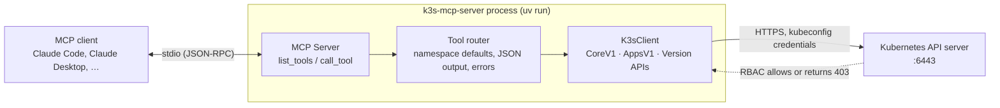
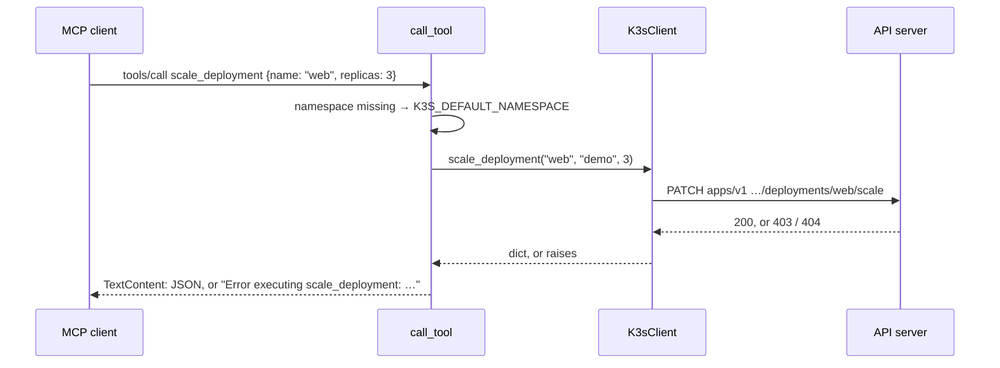

# Architecture

k3s-mcp-server is one Python module, [`src/k3s_mcp_server/server.py`](../src/k3s_mcp_server/server.py). It turns MCP tool calls into Kubernetes API calls through the official Python client. It has no database, no cache and no state between calls. The kubeconfig decides which cluster it reaches and what it may do there.



## Components

| Piece | What it does |
|---|---|
| **MCP server** | `mcp.server.Server` from the MCP Python SDK (pinned below 2.0). `list_tools` returns 13 tool definitions with JSON Schemas. `call_tool` hands each call to the router. It runs over stdio until the client closes the pipe. |
| **Tool router** | One `call_tool` function: fills in the default namespace, calls the matching `K3sClient` method, and formats the result. |
| **`K3sClient`** | Loads the kubeconfig once and holds the API clients. The tools use `CoreV1Api` and `AppsV1Api`; batch and networking clients are created but unused. Each method is a thin wrapper over one or two API calls that trims the response down to the fields worth reading. |
| **Kubernetes API** | Does all the real work, including authentication and authorization. The server never checks permissions itself. |

## Startup

1. The client runs `uv --directory <repo> run k3s-mcp-server`. That console script calls `run()`, which runs the async `main()`.
2. Importing the module creates the single `K3sClient`, which loads `$KUBECONFIG` (default `~/.kube/k3s-cortex-config.yaml`). A missing or unreadable file prints an error to stderr and **exits**. Nothing is reported over MCP, so check the client's log.
3. `main()` opens the stdio transport and serves requests. Everything the server prints goes to stderr, because stdout carries the protocol.

Loading the kubeconfig doesn't contact the cluster. An unreachable API server shows up as an error on the first tool call, not at startup.

## A tool call



### Namespaces

- **List tools** (`get_pods`, `get_deployments`, `get_services`): no namespace means **all namespaces** (`list_*_for_all_namespaces`).
- **Single-object tools**: no namespace means `K3S_DEFAULT_NAMESPACE` (default `default`).
- **`apply_manifest`**: uses the `namespace` argument, then the manifest's own `metadata.namespace`, then `K3S_DEFAULT_NAMESPACE`.

### Results and errors

- Structured results are returned as pretty-printed JSON in a single `TextContent`. Logs and command output come back as plain text.
- Any exception, whether an API error, unsupported kind or bad YAML, is caught and returned as text: `Error executing <tool>: <message>`, with the HTTP status (for example `(403) Reason: Forbidden`). The call doesn't set the MCP `isError` flag, so clients see errors as ordinary text.

## Tools and the API calls behind them

| Tool | Kubernetes API | RBAC it needs |
|---|---|---|
| `get_pods` | `list_namespaced_pod` / `list_pod_for_all_namespaces`, with an optional label selector | `list pods` |
| `get_deployments` | `list_namespaced_deployment` / `list_deployment_for_all_namespaces` | `list deployments.apps` |
| `get_deployment` | `read_namespaced_deployment` | `get deployments.apps` |
| `get_services` | `list_namespaced_service` / `list_service_for_all_namespaces` | `list services` |
| `get_nodes` | `list_node` | `list nodes` (cluster-scoped; the built-in `view` role doesn't include it) |
| `get_namespaces` | `list_namespace` | `list namespaces` |
| `get_logs` | `read_namespaced_pod_log` with `tail_lines` (default 100) | `get pods/log` |
| `get_cluster_info` | `VersionApi.get_code` + `list_node` + `list_namespace` | `list nodes`, `list namespaces` |
| `scale_deployment` | `patch_namespaced_deployment_scale` | `patch deployments.apps/scale` |
| `restart_pod` | `delete_namespaced_pod`; the owning controller re-creates it | `delete pods` |
| `execute_command` | `connect_get_namespaced_pod_exec` over a WebSocket stream, no TTY or stdin | `create pods/exec` |
| `apply_manifest` | `create_namespaced_{pod,deployment,service}` | `create` on that kind |
| `delete_resource` | `delete_namespaced_{pod,deployment,service}` | `delete` on that kind |

[`deploy/rbac.yaml`](../deploy/rbac.yaml) grants all of the read rows cluster-wide (`view` plus a node-reader role) and the write rows only in namespaces bound to `edit`.

## Security boundary

The server holds no secrets of its own and adds no permission checks. **The kubeconfig's RBAC is the boundary.** Five tools change state, and `execute_command` runs arbitrary commands inside containers, so:

- Give the server a scoped service account, not cluster-admin. See the README's [Safety](../README.md#safety) section.
- Keep tool approval on in your MCP client, so a person sees each write before it runs.
- The kubeconfig holds a bearer token. Keep it at mode `600`; deleting the `k3s-mcp-token` Secret revokes it.

## Known limits

These are properties of the current code, not of Kubernetes:

- **`apply_manifest` creates; it doesn't apply.** There's no server-side apply or patch, so an existing name returns `409 Conflict`. It takes one object per call: multi-document YAML (`---`) fails to parse.
- **Three kinds.** `apply_manifest` and `delete_resource` handle Pod, Deployment and Service only.
- **No events, metrics or log following.**
- **Blocking calls.** The Kubernetes client is synchronous and is called directly from async handlers, so one slow API call holds up the next. That's fine for one client issuing one call at a time, which is how MCP clients use it.
- **Errors aren't flagged.** Failures come back as normal text, not with `isError: true`.

## Repository layout

```
src/k3s_mcp_server/server.py   the whole server: K3sClient, tool definitions, router, entry points
src/k3s_mcp_server/__init__.py package metadata (__version__)
deploy/rbac.yaml               least-privilege service account for the server
scripts/setup.sh               checks uv, runs uv sync
scripts/test-connection.sh     exercises K3sClient against your cluster
docs/                          these guides and the README animations
```
